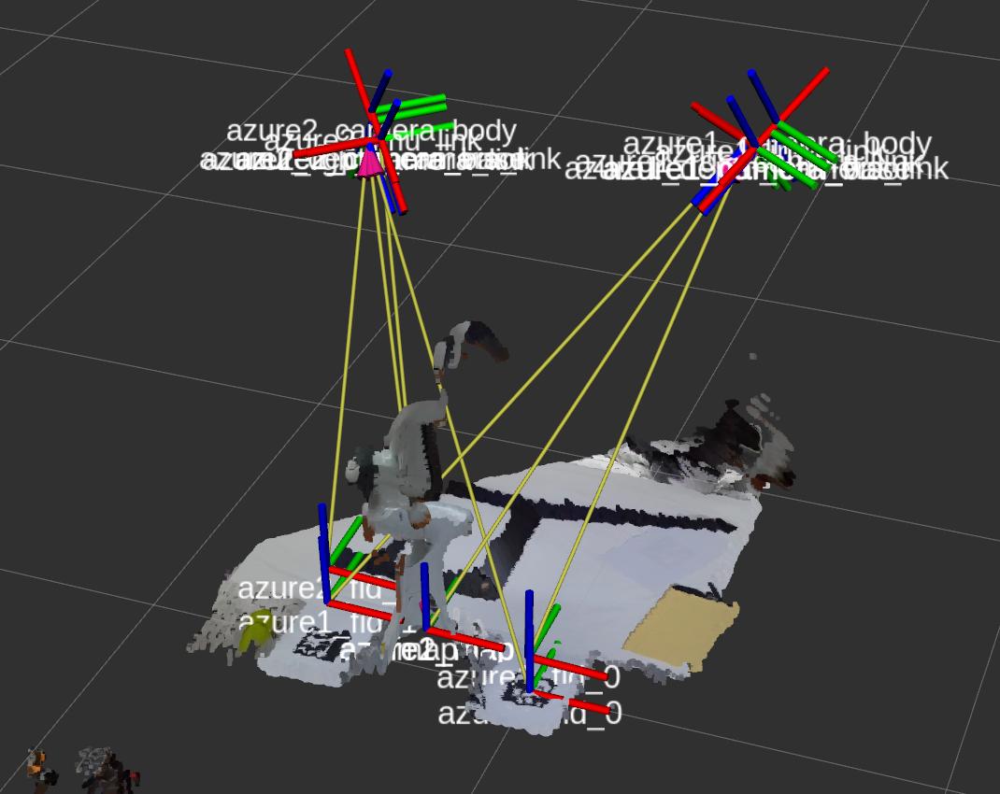

# assembly_camera_manager
camera manager for furniture assembly project (Kinect Azure and Zivid) using ArUCO marker

## Features

- Intrinsic & Extrinsic Calibration for Kinect Azure using ArUCO
- tf manager for map and cameras

## Dependencies

- Azure Kinect driver & ROS Wrapper
- Intrinsic Calibration: Azure Kinect python wrapper: https://github.com/brendandburns/py-k4a
- fiducials: sudo apt-get install ros-melodic-fiducials


## Usage

### Intrinsic Calibration

1. Print aruco marker board (imgs/aruco_marker_board.pdf)
2. Capture 50 images of marker board 
```
python src/capture_frame_azure.py {file_name}
```
3. Calibrate the intrinsic parameter 
```
python src/calibrate_azure.py
```

### Extrinsic Calibration for single camera

1. Generate markers (In our case, cv2.aruco.DICT_7X7_50 was used)
```
python scripts/generate_markers.py 
```
2. Print the markers and place it where you want.

3. Launch Kinect Azure driver and auto_detect_slam
```
ROS_NAMESPACE=azure1 roslaunch azure_kinect_ros_driver driver.launch sensor_sn:=000696793812 fps:=5 color_resolution:=720P depth_mode:=WFOV_UNBINNED
roslaunch assembly_camera_manage single_azure.launch
```

### Extrinsic Calibration for multiple camera

```
ROS_NAMESPACE=azure2 roslaunch azure_kinect_ros_driver driver.launch sensor_sn:=000853594412 wired_sync_mode:=2 subordinate_delay_off_master_usec:=160 fps:=5 color_resolution:=720P depth_mode:=WFOV_UNBINNED tf_prefix:=azure2_
ROS_NAMESPACE=azure1 roslaunch azure_kinect_ros_driver driver.launch sensor_sn:=000696793812 wired_sync_mode:=1 fps:=5 color_resolution:=720P depth_mode:=WFOV_UNBINNED tf_prefix:=azure1_
roslaunch assembly_camera_manager double_azure.launch
```



## TODO

- Elaborate intrinsic calibration for accurate point cloud merge and extrinsic calibration (Currently, we are using factory calibrated values)
- Support for Zivid

## References

- [Aruco_Tracker](https://github.com/njanirudh/Aruco_Tracker)
- Aruco calibration: https://github.com/abhishek098/camera_calibration
- https://www.learnopencv.com/augmented-reality-using-aruco-markers-in-opencv-c-python/


